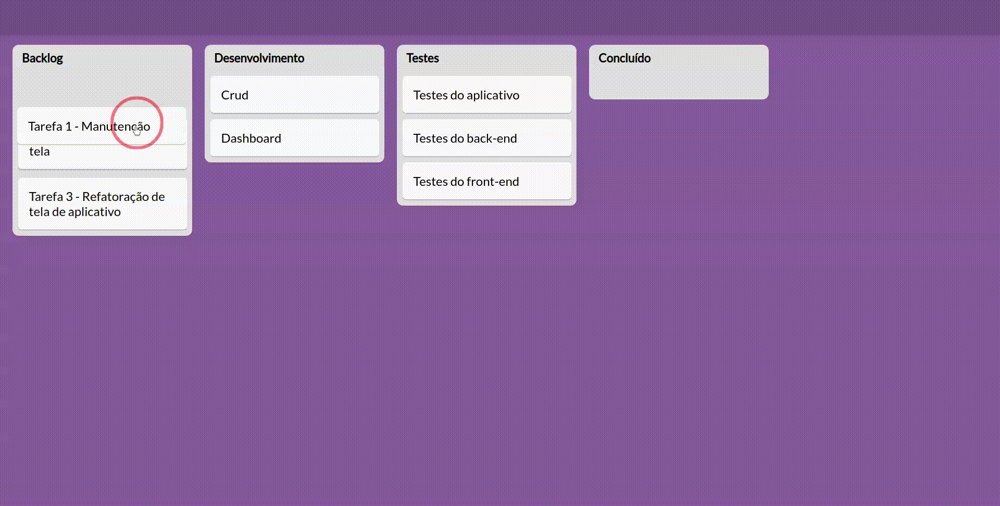

# UI Clone simples do Trello
Clonando o **Drag and Drop** do Trello com Vue, HTML e CSS

| :placard: Vitrine.Dev |     |
| -------------  | --- |
| :sparkles: Nome        | **Trello UI Clone**
| :label: Tecnologias | Vue, Javascript, HTML, CSS
| :rocket: URL         | -
| :fire: Desafio     | https://www.youtube.com/channel/UCS5IxD9kAh5uO5ZdBtXPr8g

Scrollando pelo YouTube acabei encontrando esse tutorial incrível do canal do [Fábio de Abreu](https://www.youtube.com/channel/UCS5IxD9kAh5uO5ZdBtXPr8g): https://www.youtube.com/watch?v=YmJzRpMFdDY. Precisei colocar em prática, já que sempre quis fazer algo parecido com a funcionalidade de arrastar cards do Trello.

## Preview
<!-- Inserir imagem com a #vitrinedev ao final do link -->

<!-- 

    

-->
